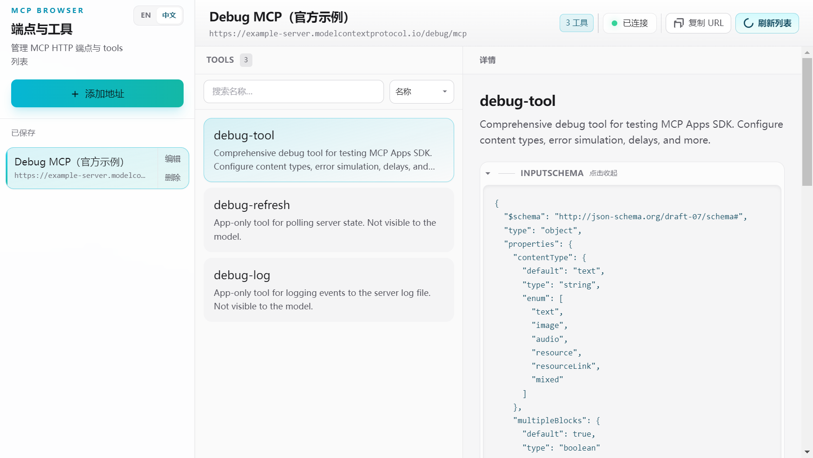
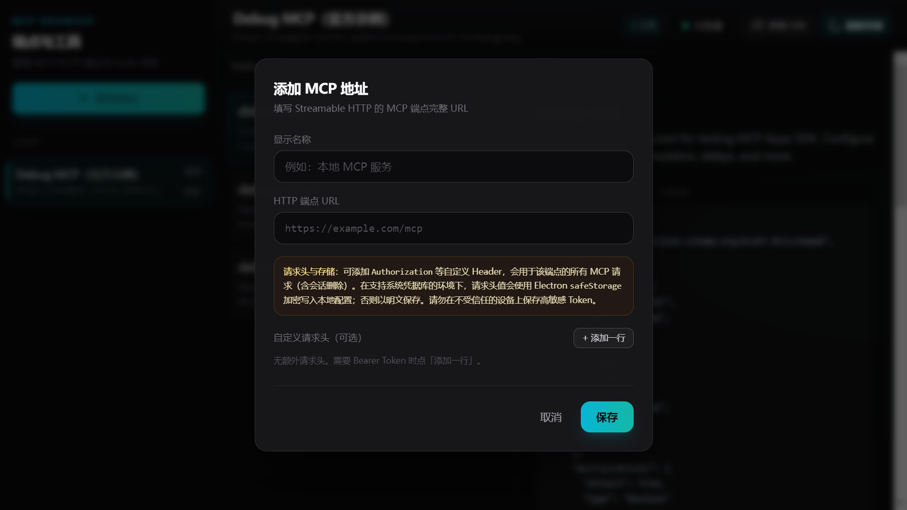

# MCP Browser

**MCP Browser** 是一款开源 **Electron 桌面应用**，用于 **管理 MCP（Model Context Protocol）HTTP 服务端点**，并 **浏览工具列表**（`tools/list`）：名称、说明与 **`inputSchema`**（JSON）。

**作者 / 维护者：Guo's**

**仓库：** [github.com/unicorngithub/MCP-Browser](https://github.com/unicorngithub/MCP-Browser)

[English](README.md) | 简体中文

---

## 界面预览

配图基于 **[MCP Feature Reference Server](https://example-server.modelcontextprotocol.io/)** 的 **`https://example-server.modelcontextprotocol.io/debug/mcp`**（Debug MCP App，Streamable HTTP，无需 OAuth）。同域 **`/mcp`** 可能需鉴权，详见官网。

<p align="center">
  
</p>

<p align="center"><em>主窗口：默认<strong>简体中文</strong>，侧栏可切换 <strong>EN / 中文</strong>；菜单栏与系统对话框与界面一致。已连接官方 Debug 示例 — 工具列表与详情（说明、<code>inputSchema</code>、工具测试）。</em></p>

<p align="center">
  
</p>

<p align="center"><em>添加 / 编辑端点；可配置 <code>Authorization</code> 等请求头。</em></p>

---

## 功能概览

- **多地址管理**：增删改 MCP HTTP 端点，本地 **electron-store** 持久化；**文件** 菜单 **导出 / 导入** 端点 JSON（备份、迁移）。
- **窗口模式**：**显示** → **窗口模式**（在「刷新界面」下方）— **单窗口**（默认）或 **多标签**；多标签时每页为完整工作区（侧栏 + 工具），**+** 新建、**×** 关闭（至少保留一页）；模式写入独立配置（`mcp-browser-window-mode`）。
- **连接与工具**：主工具栏可选 **MCP HTTP 传输**（如 Streamable HTTP / SSE，依服务端能力）；**Streamable HTTP** 下按规范完成 `initialize` → **`Mcp-Session-Id`** → `notifications/initialized` → **`tools/list`**；工具列表与详情（`inputSchema`）、工具调用与请求/响应查看。
- **界面与菜单**：中英界面（**react-i18next**）；**设置 → 外观**（浅色 / 深色 / 跟随系统）；**帮助**（使用说明、检查更新、MCP 规范链接等）；菜单与原生对话框与界面语言同步（`appLocale`、`appShellStrings`）。
- **技术栈**：React 18、TypeScript、Vite、Tailwind CSS、Zustand

## 环境要求

- **Node.js** 18+（推荐 20 LTS）
- **pnpm** 或 npm

## 快速开始

```bash
git clone https://github.com/unicorngithub/MCP-Browser.git
cd MCP-Browser
pnpm install
pnpm dev
```

仅编译（`tsc` + Vite，产物在 `dist/`、`dist-electron/`）：

```bash
pnpm build
```

打包安装包（与平台相关，建议在目标系统执行；按 `electron-builder` 配置）：

```bash
pnpm dist
```

仅输出解包目录（如 `release/<版本>/win-unpacked/`，不生成 NSIS）：

```bash
pnpm run dist:dir
```

清理后完整重编（含安装包）：

```bash
pnpm clean
pnpm rebuild   # clean 后再 dist
```

### 使用 pnpm 时

若 Electron 安装或启动异常，请确认 `package.json` 中 `pnpm.onlyBuiltDependencies` 包含 `electron`、`esbuild`，删除 `node_modules` 后重新安装。

## macOS：无法打开或提示「已损坏」

预构建包 **未经 Apple 公证**，被拦截或提示「已损坏」多数是 **门禁（Gatekeeper）与下载隔离（quarantine）**，**不是**安装包损坏。

**优先**在已安装的 `.app` 上清除隔离（路径按实际安装位置修改）：

```bash
sudo xattr -r -d com.apple.quarantine /Applications/MCP\ Browser.app
```

若安装在用户目录下，例如 `~/Applications`：

```bash
sudo xattr -r -d com.apple.quarantine ~/Applications/MCP\ Browser.app
```

仍无法打开时，到 **系统设置 → 隐私与安全性** 允许运行；必要时可临时 `sudo spctl --master-disable` 放宽全局门禁（用毕 `sudo spctl --master-enable`）。更细步骤见 [docs/macOS安装与无法打开说明（macOS-install-troubleshooting）.md](docs/macOS安装与无法打开说明（macOS-install-troubleshooting）.md)。

## 目录结构

```text
├── build/             electron-builder 用图标（`icon.png`、`.ico` / `.icns`）
├── docs/images/       README 截图；非 Linux 可用 `pnpm test:update-screenshots` 更新
├── electron/          主进程、preload、IPC、MCP 客户端
├── public/            静态资源
├── scripts/           辅助脚本（如 `clean.mjs`）
├── shared/            共享类型、语言与主进程文案等
├── src/               React 界面与状态
├── dist/              Vite 构建产物
└── dist-electron/     Electron 主进程与 preload 构建产物
```

## 常用命令

| 命令 | 说明 |
|------|------|
| `pnpm dev` | 开发：Vite + Electron |
| `pnpm build` | 仅 `tsc` + Vite（不生成安装包） |
| `pnpm dist` | 先 `pnpm build`，再 electron-builder（安装包） |
| `pnpm run dist:dir` | 先 `pnpm build`，再 `electron-builder --dir`（仅解包目录） |
| `pnpm clean` | 删除 `dist/`、`dist-electron/`、`release/`、`node_modules/.vite` |
| `pnpm rebuild` | `clean` 后 `dist` |
| `pnpm test` | Vitest（E2E 需外网；Linux 跳过；**不**覆盖 README 配图） |
| `pnpm test:update-screenshots` | 刷新 `docs/images/*.png` 等 |
| `pnpm preview` | 预览 Vite 构建后的渲染进程 |

## 安全说明

- 已启用 **contextIsolation**；preload 仅暴露受限 API（`mcpDesktop`、`updaterIpc` 及主题 / 语言 / 菜单 / 窗口模式等辅助接口）
- MCP **HTTP 请求在主进程** 发起，避免渲染进程 CORS 限制

## 开源协议

**MIT**，全文见 [LICENSE](LICENSE)；著作权人为 **Guo's**。

再分发二进制或源码集合时，请按依赖许可证要求一并保留 **LICENSE** 与 **[NOTICE](NOTICE)**（内含第三方许可与声明义务汇总）。

## 参考

- **[Model Context Protocol](https://modelcontextprotocol.io)** — 本客户端所对接的公开协议与文档。

各 npm 依赖遵循各自许可证；细节见包内说明及 **NOTICE**。
